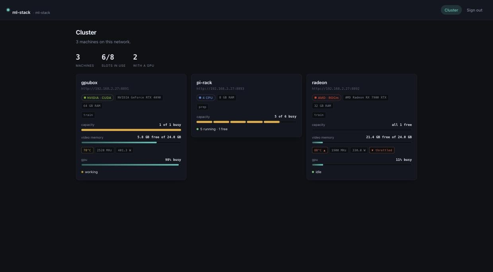
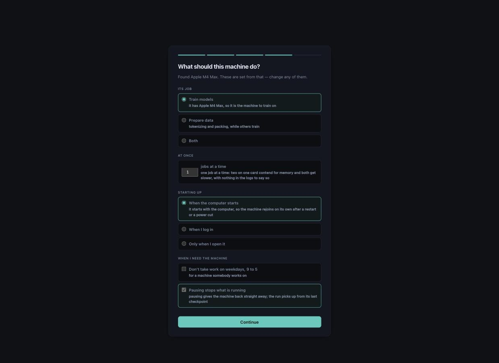
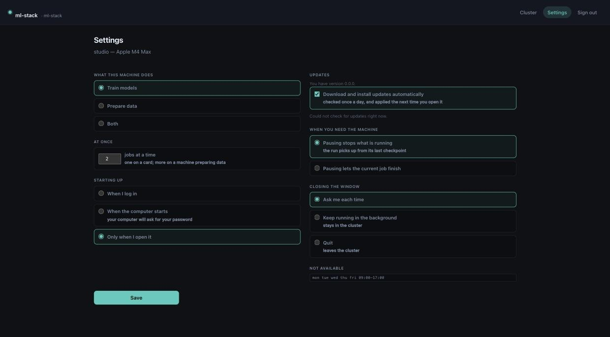

# ml-stack

**Run and train models across every machine in your house.**

Install it on each one and type the same passphrase. They find each other on their own —
no addresses, no keys to copy, no config file. Chat with a model from any machine,
whichever one is actually running it. Work goes to whichever machine is free and fastest:
the box with the card trains, the spare CPUs prepare data, and any of them can be taken
back the moment you want it.

```
$ ml-stack-peers ls
NAME             URL                          FREE    STATE      DEVICE
gpubox           http://192.168.2.27:8770     0/1     busy       NVIDIA GeForce RTX 4090  6.2/24.0 GB free
radeon           http://192.168.2.31:8770     1/1     idle       AMD Radeon RX 7900 XTX  22.1/24.0 GB free
mac-studio       http://192.168.2.44:8770     1/2     idle       Apple M2 Ultra  96.0/128.0 GB free
pi-rack          http://192.168.2.51:8770     5/6     busy +2    16 cpu
```

Everything runs on your own hardware. Nothing leaves the network.



[Full list of what it does](docs/FEATURES.md).

- **Chat from any machine.** The one with the card runs the model; the laptop talks to
  it. A machine that installs nothing extra still gets to use it, and conversations are
  kept.
- **Nothing to configure.** A passphrase is the whole setup. Two households on one
  network stay separate without either of them being told to.
- **Work lands where it fits.** Placement is by what a machine reports and how fast it
  has actually been measured, per kind of work. A machine nobody has measured is tried,
  not skipped.
- **Your machine stays yours.** Block out working hours, or hit pause when you start a
  game — the run stops, requeues, and picks up from its last checkpoint.
- **Train without writing code.** Pick what you want it to learn, point it at your
  files, and it runs. Or drive it from Python if you would rather.
- **Mixed hardware is the normal case.** NVIDIA, AMD ROCm, Apple silicon and plain CPUs
  in one cluster, each reporting its own temperature, clocks and throttle state.

## Installing

**One line**, on macOS or Linux:

```
curl -fsSL https://raw.githubusercontent.com/adammikulis/ml-stack/main/packaging/install.sh | sh
```

On Windows, in PowerShell:

```
irm https://raw.githubusercontent.com/adammikulis/ml-stack/main/packaging/install.ps1 | iex
```

It works out which machine it is on, fetches the right download, and opens it. You get a
window that asks what to call the machine and which cluster to join, then sets the rest
from the hardware it finds:



**Or download it yourself** from the [latest release](../../releases/latest):

| | |
|---|---|
| macOS | `ml-stack-macos-arm64-<version>.zip` — Apple silicon (M1 or later) |
| Windows | `ml-stack-windows-x86_64-<version>.zip` |
| Linux | `ml-stack-linux-x86_64-<version>.zip` |

Each download holds the app and `ml-stack-headless`, for a machine with no screen — the
same daemon, serving the interface to a browser on your network.

Do the same on every machine you want to train with, typing the same passphrase. They
find each other on their own.

**If you write Python**:

```
pip install ml-stack            # all of it, and nothing else. No dependencies.
pip install ml-stack[train]     # and numpy and safetensors, to train
pip install ml-stack[all]       # and everything the rest of it can use
```

Building from source needs `pip install build`, then:

```
python packaging/build.py            # wheels into dist/
python packaging/build.py --bundle   # and a standalone app for this platform
```

Everything is adjustable later:



## Driving it from Python

`ml-stack` has no dependencies, so the machine you drive from needs no CUDA, no MLX
and no training stack.

```python
from ml_stack.fleet import Peer, Requires, Unit, run

peers = Peer.discover()
report = run(
    [Unit(id=f"shard{i}",
          argv=["python", "-m", "ml_stack.train.run", "--recipe", "text-lm",
                "--data", f"shards/{i}.jsonl", "--out", f"out/{i}"],
          requires=Requires(labels=("train",), min_vram_gb=8))
     for i in range(8)],
    peers, kind="text-lm")

for place in report:
    print(place.unit_id, place.peer, place.state, f"{place.elapsed_s:.0f}s")
```

Work waits for capacity rather than failing, is retried on a *different* machine if it
fails, and a machine that fails several in a row is set aside rather than draining the
queue. A unit no machine can run fails at once, naming every machine and why:

```
gpubox: has 23.0 GB VRAM, needs 80.0
pi-rack: does not report 'cuda'; has no backends
radeon: this machine is in use (mon tue wed thu fri 09:00-17:00); work resumes Mon 17:00
```

One machine at a time, when that is what you want:

```python
rtx = Peer.find_one(require="cuda")     # refuses to guess between two
rtx.push("data/train.jsonl", "data/train.jsonl")
job = rtx.submit(["python", "-m", "ml_stack.train.run", "--recipe", "text-lm",
                  "--data", "data/train.jsonl", "--out", "out/lm"])
rtx.wait(job["id"], on_metric=print)
rtx.pull("out/lm/step_000010000/model.safetensors", "local/model.safetensors")
```

Uploads and downloads resume and are verified by digest.

## Training

`Trainer` runs the loop on PyTorch or MLX — the framework is taken from the model, so
the same call works on a Mac and on a CUDA box:

```python
from ml_stack.train import Trainer, warmup_cosine

report = Trainer(model, optimizer, loss, out="runs/small").fit(
    batches, steps=100_000,
    schedule=warmup_cosine(3e-4, total_steps=100_000, warmup_steps=2_000),
    eval_data=holdout, eval_every=1_000, checkpoint_every=1_000)
```

Checkpoints are atomic and resumes are exact — weights *and* optimizer state, or it
refuses. `steps` is a total, so re-running the same call after a crash finishes the run
rather than doubling it. A run that goes non-finite is stopped before it writes a
checkpoint of a model that is already NaN.

Every piece is usable on its own for a loop you write yourself: `CheckpointState`,
`MetricsLog`, `RunLock`, the schedules, the guards, the leak-safe splits.

Or skip the code entirely and use a recipe:

```
ml-stack-train-run --recipe text-lm --data corpus.jsonl --out runs/lm --dry-run
```

`--dry-run` trains twenty steps and writes nothing, so a bad setting costs forty seconds
instead of six hours.

### Fine-tuning a tool caller

```
ml-stack-train-tools --tools python:ml_stack.graph.ask:TOOLS \
    --prompts python:ml_stack.graph.ask:TOOL_PROMPTS --out runs/caller
```

Plug in a project's tools and end with a GGUF that calls them. One command, three stages,
each skipped when `--out` already holds its output:

- **synth** writes `data/train.jsonl`, `data/holdout.jsonl` and `data/manifest.json`. The
  seed is the worked examples the tool descriptions already carry — `for "Which companies
  do people here work for?" call list_kind with {"kind": "org"}`, or `"What does Quenlow
  Robotics do?" → web_search(query="Quenlow Robotics")` — because those are what was
  measured to matter (17% to 70% recall on the same weights, above). The router's example
  questions come in through `--prompts` (a `chat` key is the messages that want no tool),
  and all of it is templated into conversations: system, user, an assistant turn that
  calls the tool — and a share that call nothing, so the model learns when not to.
  Arguments come from the question where they can (its words, a URL, an enum value it
  names) and from a worked example where they cannot, so an id-shaped argument is always
  one a description showed. One seed question in ten is held out by hash, and every
  paraphrase of it goes with it. `--ask URL` has a served model write more questions per
  tool with the examples as few-shots, which is also where better arguments come from;
  `--per-tool` is how many conversations each tool gets.
- **train** runs the `tool-calls` recipe: `--base` (`google/functiongemma-270m-it` unless
  told otherwise) with every conversation rendered through its own chat template and the
  loss on the assistant tokens only, into `run/` — checkpoints, `metrics.jsonl`, resumable.
  `--set steps=600` and the other recipe fields work as in `ml-stack-train-run`. It is
  torch whatever the machine's default backend is, on the accelerator unless
  `ML_STACK_DEVICE=cpu` says otherwise.
- **export** puts the latest checkpoint back into Hugging Face layout under `model/` and
  hands it to `ml_stack.gguf.export` — llama.cpp's converter and `llama-quantize`, `--quant
  Q8_0` — so the GGUF lands in `--out`, ready for `ml-stack-serve up`.

`--dry-run` prints the plan with counts and loads no model; `--only synth|train|export` runs
one stage. The data is plain JSONL rows of `{"messages", "tools"}`, so `ml-stack-train-run
--recipe tool-calls --data runs/caller/data` trains on it too, and so does anything else
that writes that shape. Whether the fine-tune beats its base is measured, never assumed:
serve the GGUF and `ml-stack-bench run` it beside the model it came from.

The next recipe is embeddinggemma for `graph.route`: a contrastive fine-tune on the same
question → tool pairs, so the router that chooses which tools to offer learns the project's
questions as well. It is not built yet.

## Packages

| Module | What it is |
|---|---|
| `ml_stack.contracts` | Reader for `contracts/`; the RAM→model ladder and the fitting rule |
| `ml_stack.media` | WAV containers, image format sniffing, resumable asset download |
| `ml_stack.client` | HTTP client: chat, completion, embeddings, health, token estimate |
| `ml_stack.fleet` | Find the other boxes, run jobs on them, move files between them |
| `ml_stack.serve` | Start, adopt and tear down a model server |
| `ml_stack.gguf` | Converter/quantiser discovery, export, tokenizer-metadata repair |
| `ml_stack.speech` | ASR / TTS / VAD behind three protocols and one resolver |
| `ml_stack.vision` | Image payloads, and a gate that verifies a model can see |
| `ml_stack.backend` | One array API over MLX and PyTorch, so math is written once |
| `ml_stack.graph` | A graph: stored, searched, asked about, drawn — and as tensors |
| `ml_stack.entities` | Resolving names, planning edits, spelling, paths through a graph |
| `ml_stack.scrape` | Reading a site you are signed in to, with presets to start from |
| `ml_stack.train` | Atomic checkpoints, schedules, guards, metrics, leak-safe splits, tokenizer fertility |
| `ml_stack.testing` | Cross-backend numerical parity harness |

Everything above ships in one package. The extras carry what a module needs beyond the
standard library: `[app] [train] [serve] [gguf] [graph] [store] [scrape] [vision] [testing]
[torch] [mlx] [telemetry]`, and `[all]`.

## Working with a graph

A graph here is a mapping with `nodes` and `edges` and nothing else agreed in advance —
what a project calls its kinds and its relations is the project's business.

```python
from ml_stack.graph import GraphStore, replace, converse, render, hybrid

replace("graph.ladybug", graph)              # safely: see below
with GraphStore("graph.ladybug") as store:
    store.set_embedding("person:ada", vector)
    store.similar(vector)                    # nearest by meaning
    store.search("compiler")                 # stemmed, so it finds "compilers"
    store.shortest_path("person:ada", "person:bea")

hybrid(graph, "who fixes machines", store=store, vector=asked)   # all three at once
converse("how are these two connected?", graph, client)          # the model, with tools
open("page.html", "w").write(render(graph, title="Who knows what"))
```

**The model is given five things it can do, not the graph.** `look_up` finds entries by
name or by the words attached to them, `look_at` reads what is held on them, `path_between`
traces how two connect, `list_kind` reads out everything of one kind, and `show` says what
the answer is about. `list_kind` exists for the question no search reaches: "which companies
do people here work for?" is answered by every `org` in the graph, and no word finds those,
because nothing is *labelled* company — a small model searched "company", then
"organization", found nothing and gave up. A kind the graph does not have comes back as the
kinds it does, with counts, so a wrong guess costs one call rather than a turn. An answer
that comes back empty says why in `steps` — `no answer: finish_reason=stop, thinking 628
chars, answer 0 chars` — because the assumption is always the token budget and, measured,
it almost never is. A tool of the caller's own that returns pictures (`_images` in its
result) has them shown to the model as a message of their own, since a tool result cannot
carry an image; a picture that cannot be prepared is a line in `steps`, not a crash.

**A hit that says why it matched, and who is joined to it, is behind a flag until it is
measured.** `look_up` returns `{id, label, kind}` and nothing else, so a model cannot tell an
exact label from one word in one quote, and a topic it finds is only halfway to the people
who have it — measured against a real graph, every staffing question spent rounds guessing
spellings. `tools_for(graph, rich=True)` (and `converse(..., rich=True)`, `hybrid(...,
rich=True)`) adds `score`, `matched` — which of `label`, `attribute`, `said`, `words`,
`meaning` found it — and, on anything that is not a person, `joined`: the eight
most-mentioned people on any edge to it. The look_up description gains one sentence saying
so, on a copy. With the flag off nothing observable changes, byte for byte, because the
answer cache fingerprints those descriptions and a sweep of the current behaviour has to stay
comparable with the one that measures this.

**The page's routes come with the page.** `graph.html` streams its answers from
`/ask/stream`, falls back to `/ask`, and reopens a conversation from `/thread/<name>`;
`ml_stack.graph.serve.AskRoutes` is that server side for any `http.server` handler. A
subclass says how a question is answered (`asker`) and where conversations are kept
(`threads`), and hangs its own journal or queue off `answered`; the SSE framing, the `done`
frame carrying the whole answer, the history handed back to the model and the turns
remembered with their `steps` are the library's. Who may ask is still the project's policy.

**A store cannot be lost to a bad rebuild.** A pipeline that read nothing produces an empty
graph, and an empty graph looks exactly like "remove everything". `replace` refuses a write
that would take most of a store, and leaves a verified snapshot when it would take a tenth.
`snapshot` and `roll_back` are there directly, and a restore saves what is there first.

**Two processes cannot corrupt one.** The database's own lock stops the second writer with an
IO error; what `ml_stack.graph.access` adds is knowing whose lock it is, waiting for a turn,
and letting go of a read handle when a writer wants in.

**The files around a graph are the same in every project.** `ml_stack.files.write_json`
writes beside the file and renames over it, so whatever is reading the graph while a
pipeline rewrites it sees the old one or the new one and never half of either;
`prune_orphans` deletes the per-record files (an extraction per message) whose record the
log has since dropped. `ml_stack.geo.geocode_all` turns the places people write — "Raleigh",
"MD", "sf" — into points through Nominatim, cached to a JSON file, one request a second,
picking the answer that is actually *called* what was asked rather than the county Nominatim
ranks first; pass your own `user_agent`, as its usage policy asks. `ml_stack.redact.names_in`
reads every name a graph and its message log hold, for a `Redactor` to keep out of anything
printed.

### Message formats

**A corpus is one list, whichever product it came from.** `ml_stack.world.Message` is the
shape every reader returns and every emitter writes: a world id, a `source`, a `channel`, a
`sender`, a Slack-style `ts`, the text, and `thread` naming the root. `ml_stack.sources.read`
looks at a path and reads a Slack export directory, an mbox, a Microsoft Graph
`chatMessage` dump or the rows a Slack scraper writes -- each also there by name
(`sources.slack_export`, `sources.mbox`, `sources.teams`, `sources.rows`). Given the
world's people (`id -> {"label", "email"?, "handle"?}`) a reader puts `person:` ids back on
every `U0…`, address and Graph uuid; without them the product's id stays in `sender` and
`attrs["sender_kind"]` says whose it is.

```python
from ml_stack import sources
from ml_stack.world.emit import slack_export, mbox, teams, rows

slack_export(messages, people, "demo/slack", domain="pellard.example")  # users.json, channels.json, dms.json, <channel>/<day>.json, dms/<D0…>/
mbox(messages, people, "demo/mail.mbox")                              # From/To/Cc/Date/Subject/Message-ID/In-Reply-To/References
teams(messages, people, "demo/teams.json")                            # {"value": [chatMessage, ...], "channels": [...], "chats": [...]}
log = rows(messages, people)                                          # the Slack scraper's rows: channel, channelId, ts, sender, text, threadTs, scrapedAt, permalink

back = sources.read("demo/slack", people)      # sniffed; equal to `messages` up to attrs
```

The emitters write what each product actually exports -- Slack's per-day files cut at
midnight UTC with `thread_ts`, `reply_count` and `reactions`; mail that any client threads,
written through `mailbox.mbox`; Graph's `from.user`, `body.content`, `replyToId` and
`channelIdentity` or `chatId` -- with product ids minted deterministically from the world's,
and written back into each message's `attrs`. The world's id rides in the one slot each
product has for it (`client_msg_id`, Teams' `id`, an `X-World-Id` header beside
`X-World-Ts`, since `Date:` has no fraction of a second); scraper rows have none, so that
reader mints `<channelId>-<ts>` the way the scraper's pipeline does. `rows` exists so a demo
profile drops into a pipeline built on those rows with no adapter between them.

### Days that produce conversations

```python
import random
from ml_stack.world.simulate import model_writer, run, simulate, template_writer
from ml_stack.world.story import calendar

world.calendar = calendar(world, days=20, rng=random.Random(world.seed))
for message in simulate(world, days=20, writer=None, rng=random.Random(1)):   # no model
    ...
run("world/", "out/", days=20, mix=0.1, model_url="http://127.0.0.1:8080", seed=1)
```

An invented organisation is a graph until its people talk, and talk with nothing behind it
reads as noise. `world.story.calendar` lays **arcs** over the days -- for a company a
launch, an incident, a new hire's first week, an escalation, an offsite, a quarterly
review, a reorg, a deadline slip; for a community an introduction, a question that gets
answered, a meetup, a job post, a recommendation, an intro between two members; a
university has paper deadlines, grants, seminars, defences and lab moves; an open-source
project releases, bug fixes, RFCs, first pull requests and advisories; a nonprofit
fundraisers, programme launches, volunteer drives and board meetings. `World.kind` picks
the table. Who is in an arc comes from the graph: a group is any node with people joined
to it, named by the words in its label, so an incident is whoever is in "engineering" and
"support" whatever the graph calls their kinds, and a community with no `reports_to` is
scheduled from `works_with`, `part_of` and `moderates` because the sampler only ever uses
the relations it finds. Each arc says where it happens -- a Slack channel, an email
subject, a Teams chat -- and is deterministic from the seed.

`simulate` is the clock. Each working day it takes the arcs alive that day plus routine
chatter, a Poisson-ish number per person along their real relations: people who work
together talk in their team channel or a DM, a reporting line is a 1:1 DM or an email,
two people with no group in common get email or Teams. Every thread is two to eight
`Message`s with timestamps inside work hours in each sender's office timezone
(`attrs.timezone` on their place, else UTC), monotone within the thread. Who says what is
a **writer**, `(persona, prompt, context) -> str`. `template_writer` needs no model:
sentences per conversation kind and organisation kind, filled with the graph's own names
-- the speaker's project, place and subject, the group, the person they are talking to --
and never the same sentence twice in a thread. `model_writer` has a persona speak through
`converse` over the subgraph it `knows`, with its own `system` prompt, the thread so far as
turns, and its earlier threads of the same arc read back from the store as memory, so what
it said last week is what it says this week. `mix` is the share of threads the model
writes, and the arcs get it first because an arc is where consistency is noticed.

**Outcomes write back.** An arc's end leaves one typed edge in `world.graph` -- `decision`,
`moved_to`, `now_works_with` or `joined` -- carrying `attrs.said_in`, the message it was
said in, so the next conversation and the truth agree, and the graph handed in is the
graph after. **What a message costs** is two model calls: the answer, then `converse`
asking what the answer was about, which is kept because its ids are exactly the `Drew`
edges the thread memory wants. A persona is handed what its thread is about as the
`opening` -- its own entry, the project, the place, the others in the thread -- which
grounds it and stops `converse` sending an answer that touched nothing back to look. `run`
reads `graph.json`, `personas.json` and any `calendar.json` from a directory, writes
`messages.jsonl`, the graph after and the calendar used, holds `simulate.lock` while a
model is in use, and returns the counts, including `messages_per_model_call`.

## The commands

| | |
| --- | --- |
| `ml-stack-models find <words>` | search the Hub for a model, unsloth first; `files <repo>` lists the quantisations and prints the `hf:` reference to serve each; `card <repo>` reads the sampler settings its publisher recommends |
| `ml-stack-serve status\|up\|down\|build` | one model per port, in one shape; refuses a mismatched lease; announces to the fleet; `--draft auto` and `--mmproj auto` find the speculative head and the vision projector shipped with the weights; `--spec` chooses draft or n-gram guessing; `build` compiles or downloads a current llama-server and switches to it once verified, so a release lagging master by an architecture is a permanent fix rather than a one-off `--binary` |
| `ml-stack-bench prepare\|run\|sweep\|show` | time and score a graph's answers — wall clock, calls, cached tokens against read ones, KV cost, draft acceptance, and how much of the expected answer was shown; `show --rates` adds accuracy per second, per 1k tokens and per GB with the Pareto frontier, `--plot` draws it |
| `ml-stack-setup` | what this machine can do — memory a model may use and whether that survives a reboot, which architectures the installed build reads and how old it is, what is already downloaded — and what the stack does without being asked |
| `ml-stack-train-tools` | a project's tool schemas → synthetic conversations → a fine-tuned caller → a GGUF, in one command; `--dry-run` prints the plan with counts, `--only` runs one stage, `--ask` has a served model write more questions |
| `ml-stack` | the windowed app; `ml-stack-app`, `ml-stack-traind`, `ml-stack-peers`, `ml-stack-train-run` |

## Finding a model

The Hub has models newer than anything in this README, and newer than anything an assistant
was trained on. Look rather than remember:

```
$ ml-stack-models find gemma-4 E4B
    588135  unsloth/gemma-4-E4B-it-qat-GGUF
    563542  unsloth/gemma-4-E4B-it-GGUF
    307153  ggml-org/gemma-4-E4B-it-GGUF
$ ml-stack-models files unsloth/gemma-4-E4B-it-qat-GGUF
    4.1G  hf:unsloth/gemma-4-E4B-it-qat-GGUF/gemma-4-E4B-it-qat-Q4_K_M.gguf
```

Publishers in `PREFER` are ranked first — the Hub's own ordering puts whatever is popular
at the top, which for a model released last week is somebody's remix rather than the
release. The printed reference is what `ml-stack-serve up` takes; llama-server downloads and
caches it on first use, so there is no separate fetching step.

## Serving a model

From a shell:

```
ml-stack-serve up model.gguf --context 32768 --parallel 2
ml-stack-serve up hf:unsloth/gemma-4-E4B-it-qat-GGUF/gemma-4-E4B-it-qat-Q4_K_M.gguf
ml-stack-serve status
ml-stack-serve down
```

`status` prints the port, the model, the context each slot gets, how many slots there are
and which process holds the lease. `--json` gives a script the same, and it exits non-zero
when nothing is serving. `up` adopts a server already serving that model in that shape
instead of starting a second one, and prints the base URL. `down` stops only a server
started on this machine.

From Python:

```python
from ml_stack.serve import serve
from ml_stack.client import Client

with serve("model.gguf", port=8899) as server:
    client = Client(server.base_url)
    client.assert_grammar_support()          # fail now if constrained decoding is broken
    print(client.chat([{"role": "user", "content": "hello"}]).content)
```

`serve` adopts a healthy server that is already running rather than starting a second one,
and leaves an adopted server alone on exit. It only stops what it started.

A port already serving something else is refused, with the field that differs named —
the model, the number of slots, or the context each slot gets. Adopting a server of the
wrong shape hands back a lease that cannot do what was asked of it.

**Guessing ahead** comes in two shapes and `--spec TYPE` chooses. A *draft* kind runs a
second small model — `--draft auto` finds the `mtp-` head a repository ships, wherever the
publisher put it, and `--draft-ngl` decides how much of it goes on the GPU (without which it
may run on the CPU, and a draft slower than the model it guesses for is a loss). An *n-gram*
kind runs no second model at all: it proposes tokens by looking up sequences already in the
prompt, which suits work that copies from its context and costs no weights and no memory.

Where the n-gram table lives depends on the kind. `ngram-simple`, `ngram-map-k`,
`ngram-map-k4v` and `ngram-mod` keep none — the lookup is over tokens already in memory,
and nothing touches the disk. `ngram-cache` is the exception: `--lookup-cache` is written as
it generates, so what was learnt answering one question can speculate the next.

**A release lags master by an architecture or two.** Checked on this machine: the newest
homebrew bottle (`brew outdated` empty) reads `gemma4` and `qwen3moe` but not `qwen4exp`, so
Qwen3.8-Flash-Next exits with "unknown model architecture" on it. `ml-stack-serve build`
fixes that permanently rather than once: it clones or fast-forwards llama.cpp's own master
and builds it (`--from source`, Metal on macOS, CUDA or Vulkan on Windows/Linux when a
compiler is on PATH), or downloads the newest GitHub release with an asset for this machine
(`--from release`, the default with no compiler — most Windows installs). Either way the new
binary is trusted only once it answers `--help` and reads every architecture the build it is
about to replace did; only then does `~/.ml-stack/llama.cpp/current` — which `find_binary`
checks ahead of PATH and a login shell's `/opt/homebrew/bin`, though never ahead of
`--binary` or `$LLAMA_CPP_SERVER` — point at it. `ml-stack-serve build --check` reports the
installed build's commit and age without building anything; `--rollback` points `current`
back; `--persist` installs a weekly refresh (a LaunchAgent on macOS, a Scheduled Task on
Windows) that reruns it unattended — safe because a refresh that fails verification changes
nothing. `--adopt DIR` registers a flat build that already exists — a hand-built binary, or
a release someone unpacked by hand — as a managed build through the same verification,
without compiling or downloading anything; a compile already running keeps going regardless,
and only switches `current` itself once it goes on to verify. `ml-stack-setup` names the fix
directly when an architecture or a flag is missing. A one-off binary from somewhere else
still works: `ml-stack-serve up --binary /path/to/llama-server`.

Verifying by architecture *name* is only as precise as the name: measured for real, a
build's `libllama` read `phi4` and looked exactly like a missing architecture next to a
build that had it — but master's own `src/llama-arch.cpp` defines no `LLM_ARCH_PHI4` at
all; `phi4` names a chat template (`llama-chat.cpp`), not a model architecture, and Phi-4
loads through the `phi3` architecture regardless. With a source checkout to read the real
names from, the comparison is restricted to them; without one, it falls back to guessing by
family prefix, the same as before.

**A release also renames flags**, and a flag the build does not have fails at the far end
of the load: `--draft-max` became `--spec-draft-n-max`, and llama.cpp 0.3.0 keeps the old
name only to say it was removed. So `up` asks the build what it accepts (`flags_of` reads
`--help`, cached per binary and mtime) and refuses before loading, one line per flag with
the nearest the build has — `this llama-server has no --draft-max; it has
--spec-draft-n-max`. `ml-stack-setup` lists every flag `ServerSpec` can emit that the
installed build lacks, and offers `ml-stack-serve build` as the fix; it says nothing when
the build answers them all. A build that prints no help is unknown, not empty, and is given
no opinion.

`ServerSpec(draft=...)` serves a small model of the same family alongside the large one: it
guesses several tokens ahead and the large model checks them in one pass, so a run they
agree on costs about what one token used to. It takes the same two forms as the model — a
path, or `hf:owner/repo/file.gguf` — and `--draft auto` finds the one a repository ships
wherever the publisher put it: at the root, under `MTP/`, or in a sibling `-MTP-GGUF`
repository. Beware that a `-MTP-GGUF` repository is not always heads: for
Qwen3.6-35B-A3B it is the whole model rebuilt with the prediction layers in it, 36G of
weights for `--spec draft-mtp`, and `auto` correctly reports no draft rather than
offering it as one.

## A hierarchy read out of prose or a picture

```python
from ml_stack.graph.tree import FAMILY, ORG, read, to_graph

rows = read(client, ORG, images=[chart], reader=document_model)   # or text=...
graph = to_graph(rows, ORG)                                       # entries and links
```

An org chart, a family tree, a subject taxonomy and a parts breakdown are one object with
four shapes: named things, and a link from each to the one above it. A `Shape` carries what
an entry is called, what the link means and how many parents it may have — a family tree
keeps two, an org chart one, because a second manager there is a misreading.

`reader` is a second model that reads the picture first, which is how a document model gets
used for what it is good at: it transcribes, `client` structures. A picture needs a server
started with its projector (`--mmproj auto`), and a picture that cannot be prepared raises
rather than being dropped — otherwise a model is asked to read a chart with no chart
attached, and answers confidently about nothing.

## Which tool a question wants

```python
from ml_stack.graph.ask import TOOL_PROMPTS, tools_for
from ml_stack.graph.route import narrow, rank

routed = rank(question, TOOL_PROMPTS, base_url=embedder, model=name)
tools = narrow(tools_for(graph), routed)      # [] when the question wants no graph
```

`graph.route` asks a small embedder which tool a question resembles, by comparing it to
**example questions** rather than to the tools' descriptions. That distinction is the whole
of it: a question against prose describing a capability is comparing unlike things, and a
question against questions is like-to-like. The examples live in `ask.TOOL_PROMPTS` and are
never sent to the chat model, which wants the opposite text — what a tool *does*.

Both sides carry the same embedding prefix, because both are questions. Using the
asymmetric `QUERY`/`DOCUMENT` pair here scored "tell me about Otto Vance" at 0.409 against
an example reading "tell me about Iris Bellweather", which is the same sentence; with the
symmetric prefix it is 0.83.

The useful case is the one that is not a tool at all. `CHAT` collects greetings, jokes and
asides, and a message routed there is offered **no tools whatsoever** — one model call
instead of the six a graph question takes. Without somewhere for those to go, a greeting is
matched against four search tools and wins one of them: "hi" scored 0.900 against
"highlight them on the graph", because everything is close to everything and the only
question is close to *what*.

"Which companies are here?" is the other question that is not a search. Nothing in a graph
is labelled company, so `look_up` finds nothing however it is worded, and a question that
asks what *kinds* of thing are represented routes to `list_kind` instead. Its examples are
kept apart from `look_up`'s on purpose: one asks for a particular thing, the other for
everything of one sort.

Nothing narrows unless the routing was clear, `show` survives every narrowing, and an
embedder that will not answer routes nothing rather than defaulting to chat — a real
question mistaken for small talk is answered without looking anything up, which reads as a
confident answer and is about nothing.

When a search has already been run for the question — a shortlist, from the word index and
the vectors — what it found is read to the model *before* the question, as candidates to
check, and never after it as material to answer from. Measured on gemma-4-E4B: eight likely
entries handed over as the last message, phrased "use them if they answer it", took it from
58% F1 to 33%, because it echoed the list rather than selecting from it. What comes last is
what a small model answers about, so the question is the last thing it reads.

## Answering the same question twice

```python
from ml_stack.graph.ask import Answer, converse
from ml_stack.graph.cache import asked, digest, forget

out, again = asked(store, question, lambda: converse(question, graph, client),
                   kind=Answer, graph=graph, model=name, system=SYSTEM, tools=tools)
```

`asked` hands back the answer already given when nothing that shaped it has changed, and
calls the model only on a miss — measured at 27.9s against 0.00s for the repeat. What makes
that safe is the fingerprint, which covers the graph, the model, the system prompt, **the
tool schemas including their descriptions**, the shortlist and whatever `context=` the
caller adds (the turns before this one, most obviously). Rewording a tool changes what the
model does with it, so it misses — which is right: rewording them moved every score in the
bench.

`keep=` refuses an answer that should not be served twice — one whose turn also *did*
something, like filing a change request. Its answer is a receipt, and handing it out again
would tell the next person their request was filed when it was not.

A rebuilt graph misses on its own, but does not sweep on its own: pass
`forget(store, keeping=digest(graph))` after a rebuild or the store keeps every answer it
ever gave. Entries live under keys beginning `_`, which `GraphStore.docs` skips, so a cache
in the same store as a graph never leaks into `read()`.

## What this measured, and what it changed

Answering a graph is the case this was built for, so the numbers are here rather than in
somebody's notes. Ten questions over the invented community, 32k per slot, greedy, one run
at a time on an otherwise idle machine. **F1** over the entries an answer lights, with the
pair behind it, because the pair is what says how a run was wrong:

| run | F1 | recall | precision | lit per question | wall | KV + runtime |
| --- | --- | --- | --- | --- | --- | --- |
| gptoss-shortlist | **62%** | 70% | 59% | 2.0 | 198s | 11.89G |
| gptoss-plain | 61% | 65% | 62% | 2.0 | 127s | 11.89G |
| e4b-plain | 58% | 70% | 51% | 2.0 | 159s | 7.75G |
| e2b-plain | 41% | 55% | 39% | 2.3 | 59s | 3.21G |
| e4b-shortlist | 33% | 70% | 25% | 4.5 | 300s | 8.34G |
| e2b-shortlist | 29% | 80% | 18% | 6.1 | 64s | 3.50G |

A good answer lights about **1.7** entries. Read the last column against that and the table
explains itself.

**Scoring on recall alone said the opposite, and it was wrong.** Under it, `e2b-shortlist`
was the most accurate run there was at 80%, beating the 120B — because showing more costs
nothing under recall, and it lit six entries where fewer than two were wanted. A model that
lit every entry in the graph on every question scored 100%. That metric survived a day and
twenty-four green tests, none of which asked what the degenerate strategy would score. One
does now.

**A shortlist handed to a small model is echoed, not selected from.** It is the single
largest effect here: E4B 58% → 33%, E2B 41% → 29%, precision halving while recall rises.
The same shortlist does nothing for the 120B either way. The idea is sound and the machinery
is worth keeping; what is missing is teaching a model that a shortlist is somewhere to look.

**What the tool descriptions changed was real.** E4B answered 17% before they carried a
worked call and 70% recall after, on the same weights and the same questions. Six of its
nine failures had been the identical shape: two model calls, a hundred characters of prose,
no search at all. The large models never needed telling, which is why this went unseen until
a small one was measured.

Two mistakes cost the earlier numbers their meaning. Timings were taken while other runs
shared the GPU, which is why `sweep` and `run` refuse a busy server now. And every model had
512 tokens for thinking, tool calls and answer together, because `n_predict` defaulted low:
a thinking model fills that with reasoning and returns an empty answer.

None of this survives a new model release. Re-run it.

The runs themselves are in a graph store under `~/.ml-stack/bench`, which nothing backs up.
`ml-stack-bench show --export PATH` writes them out, so a day of GPU time is not on one disk.
**That file does not belong in a repository, and `--export` refuses one**: the numbers
describe one machine and one llama.cpp build, they go stale with the next model release, and
`run --graph` takes any graph, including a real community's. Back it up somewhere outside a
working tree.

What is worth keeping here is the conclusion, not the evidence. `ml-stack-bench show --rank
FILE.md` writes one line per model -- its best run, and what that run cost -- because that is
what the defaults in this library are set from, and a default with no recorded reason is a
default nobody can argue with. Both it and `--export` carry only runs whose recorded graph
fingerprint is the community that ships with this package, and refuse a run from before that
marker existed, because not knowing which graph a run read is not the same as knowing it was
invented. The ranking also ignores anything shorter than a short run, so a `--smoke` run
cannot rank a model on two questions.

## Measuring a change to the asking

```
ml-stack-bench prepare --embed-url http://127.0.0.1:8081 --embed-model embeddinggemma-300M-Q8_0.gguf
ml-stack-bench sweep --on gptoss=http://127.0.0.1:8080 --on e4b=http://127.0.0.1:8083 \
    --embed-url http://127.0.0.1:8081 --embed-model embeddinggemma-300M-Q8_0.gguf
ml-stack-bench show
```

`sweep` measures each model twice — as it is, and with a search run before it — and prints
them all in one table. `run` does one of those on its own, and `show --compare A B` puts two
side by side with the difference.

`sweep` and `run` **refuse a server that is already working**, because a timing taken while
another run has the same GPU is not a timing. It is a real failure and not a hypothetical:
several sweeps left running in the background against one server produced wall clocks that
were two runs sharing a machine, and nothing in the numbers said so. A server that will not
answer `/slots` is reported as unknown rather than assumed idle. `--anyway` proceeds on
purpose.

Serve every model being compared with the **same context and the same number of slots**, or
the comparison is of two configurations rather than two models: a model at 8k per slot is
faster and holds a smaller cache than the same model at 32k. The table prints `ctx` on every
line so a mismatch is visible rather than silent.

`look_up` is measured **as the application ships it**. With a store -- `prepare` builds one,
and `run` and `sweep` take it as their default once it exists -- every `look_up` the model
makes is `ml_stack.graph.search.hybrid`: the characters, the store's word index and, given
`--embed-url`, its vectors, fused by rank. Without one it is character matching alone, which
is what the bench measured for months while the application ran the other thing, so every
ranking it wrote ranked a `look_up` nobody used. The table prints `find` on every line --
`chars`, `words` or `meaning` -- beside `draft`, and for the same reason as `ctx`: a run
with one finder against a run with another is two measurements, not a comparison.

The questions are asked of an invented community that ships with this package, so a number
means the same thing on any machine and no real person's details are involved. Each question
may carry the ids a good answer names, which is what makes accuracy measurable rather than
impressionistic. Runs are kept in a graph store under `~/.ml-stack/bench`, so one can be
compared with another a week later.

`show` reports wall clock, model calls, prompt tokens **and how many of them were cached** —
a conversation re-sends itself every turn, so the tokens shown and the tokens actually read
are different numbers and only the second is a cost.

It also reports what the server costs to keep up beyond its weights (`kv+run`: the KV cache
and the runtime around it, measured as resident memory minus the weights on disk) and that
figure per 1k of held context (`per 1k`). The second is the one to compare: it says what one
more conversation costs, whatever context each server happened to be given, and it is what
decides how many conversations a machine can hold at once.

`show --rates` puts accuracy over each of the three scarcities — time, tokens, and the
memory a conversation holds — because a score alone cannot choose between a model that is
better and one that is cheaper. It marks the **Pareto frontier**: the runs nothing else
beats on both accuracy and cost, which are the only ones there is ever a reason to choose.
`--cost seconds|paid_tokens|kv_bytes` redraws it against whichever is scarce, and
`--plot out.html` writes it as a scatter with the frontier joined — hand-built SVG, no
library and no network, so it opens on any machine.

`--n-predict` is a **ceiling, not a budget**: nothing is spent that is not generated, so a
high one costs nothing and a low one truncates. It defaults high on purpose. A thinking
model spends most of a turn reasoning before it writes anything — measured, gemma-4 filled
a 220-token ceiling entirely with thought and returned empty content — so what a low
ceiling cuts is always the answer, never the thinking.

`--card` asks with what the model itself recommends, which is the only place a
recommendation is ever applied. It is read from the served model's **GGUF metadata** where
that exists — `general.sampling.temp`, `.top_k`, `.top_p` are written into the file, so they
cannot drift from the weights and need no prose parsed out of a README — and from the card
otherwise. The two agree where both exist: gemma-4 says temperature 1.0 / top_p 0.95 /
top_k 64 in each. They are per model, not per family: Qwen3.8-Flash-Next asks for top_k 20. A publisher's advice is a hypothesis about a task they have not seen: gemma-4
asks for temperature 1.0 across all use cases, and on this one — calling tools with exact
ids, where sampling noise becomes a wrong argument rather than a livelier sentence — greedy
measured better on the plain path. Read the card with `ml-stack-models card <repo>`, test it
with `--card`, and ship what the measurement favoured.

A score is only worth acting on when you can see which questions made it, so
`show --detail` prints the questions themselves — what each one wanted, what the answer
showed, what it missed, and what it cost — with `--detail LABEL` for one run and `--all` for
every question rather than only the ones that fell short. It is what turns a number into a
diagnosis: a model whose wrong answers took *more* calls than its right ones searched hard
and missed, while one whose wrong answers took *fewer* never reached for the tools at all,
and those two failures are fixed by opposite things.

F1 scores what was lit, and nothing else scored the prose. An answer can light the right
entries and still name one the model never found, read or showed -- a plausible name it
made up, or half-remembered from the question before -- and F1 is none the wiser. So every
row also counts the entry labels that appear in the answer's text (whole words, case aside,
as the page matches them) that no tool call produced, and `show` prints the total per run
as `made`, beside the scores; `--detail` names them, and `--rank` carries the column. Blank
on a run from before it was counted, because not counted is not none.

`sweep --serve` asks the same served model in several ways for one load: `--also terse`
describes the tools briefly, `--also card` asks with the model's own sampling, `--also
greedy` at temperature 0, and `--also rich` has `look_up` say what matched and why, with a
topic hit bringing the people joined to it.

```
ml-stack-bench concurrent e2b-4x3 --conversations 4 --turns 3 --base-url http://127.0.0.1:8080
```

Everything above asks one question at a time, which is right for timing a model and wrong
for the question a server is actually asked: how many people can talk to it at once, and
what that costs each of them. `concurrent` runs N conversations of T turns each on threads
against one server, each a chain of questions with the earlier turns carried, and records
per turn the wall clock, the time until the server began generating, and what the turn
spent waiting -- its wall clock less what the server itself reports reading and generating,
which is the queueing once N exceeds the slots `/slots` reports. For the run it keeps the
wall clock over all of them (not the sum of the turns), the most the server held while they
were in flight, sampled rather than read afterwards, and F1 as usual, so a setting that
answers faster by answering worse is visible. `show` marks such a run `4x3` in the `conc`
column; the flags a build has for holding conversations -- `--kv-unified`, `--cache-ram`,
`--cache-idle-slots`, `--slot-prompt-similarity`, `--slot-save-path` -- are typed on
`ServerSpec`, so they can be varied and the build asked whether it has them before a load.
It takes the same lock as `run` and `sweep`, and `--smoke` runs two conversations of one
turn to prove the path.

## An invented company

A demo of a graph read out of a community needs a community, and a real one cannot be shown.
`ml_stack.world` invents one from a seed: an organised group with people who have reasonable
jobs, a voice each, and a memory -- the graph -- so that when they talk (`world.simulate`)
what they say makes sense. A company is one kind of organised group; anything that
communicates in an organised way is another, and five are built in, all producing the same
schema `ml_stack.graph.community` uses so the store, the bench, the page and the ask loop
take them unchanged:

| kind | structure |
| --- | --- |
| `company` | departments under a CEO, reporting lines with spans of five to nine, customers, partners, products, projects |
| `community` | a Slack community of professionals: day jobs at *different* invented organisations, interest groups with moderators, no reporting lines |
| `university` | departments of labs, each led by a principal investigator who `advises` postdocs and students; grants, seminars |
| `open-source` | one project of many repositories; lead and core maintainers `maintain`, contributors `contribute_to`; releases, sponsors |
| `nonprofit` | programmes under an executive director, a board that `advises`, volunteers, funders |

```sh
ml-stack-world make --kind company --size medium --seed 3 --out ./world --json
ml-stack-world questions --world ./world --n 40 --out questions.jsonl
ml-stack-bench run <model> --graph ./world/graph.json --questions questions.jsonl
ml-stack-world simulate --world ./world --out ./talk --days 20 --mix 0.3 --model-url http://127.0.0.1:8080
ml-stack-world emit --from ./talk --as slack-export --out ./export
```

`make` writes `graph.json`, `personas.json`, an empty `calendar.json` and `world.json`;
`simulate` (`world.simulate.run`) has the people talk for some working days -- arcs from
`world.story` for the kind, launches or defences or releases, and routine chatter along
whatever relations the graph holds -- templated unless `--mix` hands a share of threads to
a model at `--model-url`; `emit` writes `messages.jsonl` the way Slack, a mail client, Teams
or a scraper exports it (`--as slack-export|mbox|teams|rows`), so `ml_stack.sources` reads
the invented corpus exactly as it reads a real one.

```python
from ml_stack.world.organisation import make, summary
from ml_stack.world.questions import questions

world = make("community", "small", seed=0)   # the same world every time for a seed
world.graph                                  # nodes, edges, messages: the community schema
world.personas[world.people[0]]              # {"voice", "system", "knows": [ids]}
questions(world, 40)                         # [{"q", "expect": [ids]}, ...] for the bench
```

Sizes are `small`, `medium` and `large` -- 50, 500 and 5,000 people -- and the large one is
made in well under a second (a test holds it under ten). Every person is `part_of` a unit (a department, group, lab,
repository or programme), `works_at` an organisation, is `experienced_in` a few `topic`s
drawn from the unit's own, is `based_in` a real city or remote, `works_on` a handful of
cross-unit projects, and `works_with` the people on their team and their projects; a few are
mentored. Each has a title with a level (IC1 to IC5, manager, director, VP, C-level for a
company; faculty, postdoc and student for a university; lead, core, maintainer and
contributor for a project), a responsibility in a sentence, a start date and tenure, one to
three things they would say about their work (so `look_up`'s "said" voter has something),
and a persona: a voice in a sentence, a system prompt built from their node, and `knows`,
the graph two hops out stepping through people and projects, plus everything public.

Names are assembled from syllable tables at the moment they are asked for -- six sound
families, so five thousand people do not read as one culture -- and organisations from
word stems, so nothing here is, or can recognise, a real person. The only real things are
the cities.

The questions are generated from the truth that made the world -- who reports to whom, who
works on what, who is where -- spread over the same kinds of answer the bench's own set
covers: people mostly, then organisations, places, subjects, units, paths between two
people, events, work going spare, and a few whose right answer is nobody. A kind that lacks
a relation (a community has no `reports_to`) simply asks no such question.

## Searching the web

The graph's tools see the graph and nothing else. `ml_stack.web` adds the web in the same
`(schema, callable)` shape, so a model can be handed both:

```python
from ml_stack.graph.ask import converse, tools_for
from ml_stack.web import PROMPTS, tools as web_tools

converse(question, graph, client, tools=tools_for(graph) + web_tools())
# and, for routing: rank(question, {**TOOL_PROMPTS, **PROMPTS}, ...)
```

`web_search(query)` returns titles, links and a line each; `web_read(url)` returns one
page as text, cut at a sentence, and falls through to a real browser when the plain fetch
came back thin. `web_tools(vision=True)` adds `web_look(url)` — a full-page screenshot and
the page's largest pictures, returned under `_images` for the ask loop to hand to a model
that can see. The descriptions carry worked examples, for the reason measured above.

**A model cannot read the machine it runs on.** `web_read` and `web_look` refuse anything
that is not http(s) and any host that resolves to a loopback, private or link-local
address — `file:`, `localhost`, `127/8`, `10/8`, `192.168/16` and their kin — before a
byte is fetched or a browser navigates. The browser uses its own profile
(`MLSTACK_WEB_PROFILE`, default `~/.ml-stack/web`), never the scraper's signed-in one.

`MLSTACK_SEARCH` picks the engine. `ddgs` (the default; `pip install 'ml-stack[web]'`) is
keyless, fronts several engines, and is rate-limited by them: a refusal comes back to the
model as `{"none": "search unavailable: ..."}` rather than an empty list, so it moves on
instead of asking again. `searxng` is the robust option when the questions are many: a
self-hosted instance at `SEARXNG_URL` with its JSON format enabled, reached through the
stdlib, and nobody rate-limits it but you.

## `contracts/` is data, not code

`contracts/` holds JSON describing things a runtime and a non-Python host both need to
agree on: the RAM→model tier ladder, the sampler surface, GBNF grammars. It contains no
code, so a native or scripting host can read it directly.

There is exactly one copy on disk. The wheel pulls it in at build time,
so there is no synced duplicate in the source tree to drift.

Resolution order at runtime: `$ML_STACK_CONTRACTS` → the copy inside the installed wheel → a
`contracts/` found by walking up from the source file. The walk-up is last on purpose: if a
wheel is installed *and* a repo happens to be an ancestor, the wheel's own data should win,
because that is what its version was tested against.

## Hooks

`scripts/install-hooks.sh` links the git hooks in `scripts/hooks/` into `.git/hooks`:
`no-real-names` refuses a commit whose staged files carry a person's name, `commit-msg`
refuses one whose message does. A third hook there is for Claude Code rather than git:
`scripts/hooks/claude-bash-guard` is a PreToolUse hook on Bash that refuses the shells
which keep getting written instead of ml-stack commands -- a hand-written `pgrep` waiter,
`nohup`, `llama-server` started directly, `find`-ing for GGUFs, `hf download`, curl probes
at the model, killing llama by name, `SKIP_NAME_CHECK=1` -- and names the command to run
instead. Wire it into a project's `.claude/settings.json` (the docstring shows the JSON);
`MLSTACK_GUARD=off` disables it for a session. Both hooks are tested:
`tests/test_no_real_names.py` and `tests/test_bash_guard.py`.

## Testing

```
python -m pytest tests/ -q
```

Nothing here mocks the transport. Every client test runs a real `http.server` on a real
socket, because the failures these modules exist to prevent are transport-shaped: a server
that answers `/health` while still loading, one that ignores a `Range` header, one that
returns 500 on a concurrent request. A mocked `urlopen` reproduces none of them.

The fleet tests go further: they boot real `ml-stack-traind` subprocesses and speak real
UDP on a real interface, on randomised ports so a run never answers -- or gets answered
by -- a daemon you actually have running on your LAN. A forged beacon, a replayed reply,
a multicast group a router quietly drops: a fake socket reproduces none of those either.

## Licence

Apache License 2.0. See [LICENSE](LICENSE).
