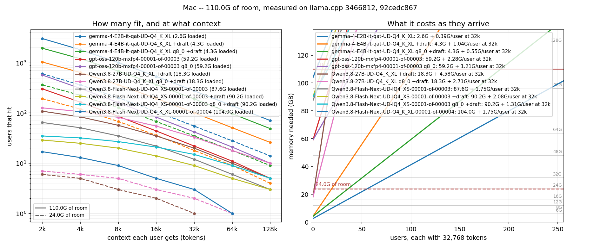

# What fits

Measured at load, not estimated -- see `src/ml_stack/data/fit.json`.

A model is smaller in memory than it is on disk, and the gap is tens of gigabytes on the models worth serving. llama.cpp mmaps the GGUF and copies into a device buffer only the tensors the backend takes; the rest stay mapped in the file and are paged, so they never appear in 'Real Mem'. Where a block below says *on disk / in GPU memory / mapped on the CPU*, those three numbers come from the load log's own `load_tensors: ... model buffer size` lines, and the one that has to fit beside the KV cache is the middle one.

The usual culprits are a lookup table that is gathered rather than multiplied (`Qwen3.8-Flash-Next`'s `per_layer_token_embd.weight` is a single 26.8G n-gram table, paged a row at a time as distinct n-grams turn up), a tensor type the backend has no kernel for, an output layer that was not offloaded, and anything past `--n-gpu-layers`. `ml-stack-serve fit MODEL --tensors` totals a file's tensors by type and by what they are for, and needs nothing running.

## This machine (110.0G)

### gemma-4-E2B-it-qat-UD-Q4_K_XL.gguf

f16 cache, measured at 32,768 tokens over 2 slots, build 3466812, 2026-09-02T18:26:52Z.

- weights 2.4G, compute 203.5M
- room 110.0G, of which 107.4G is left for caches
- **12.0K per token of context**, **12.0M fixed per sequence**
- 15 layers with a cache; a 1,024-cell sliding window per sequence

| per user context | users that fit | each costs |
| --- | --- | --- |
| 4,096 | 1832 | 60.0M |
| 8,192 | 1017 | 108.0M |
| 16,384 | 538 | 204.0M |
| 32,768 | 277 | 396.0M |
| 65,536 | 140 | 780.0M |
| 131,072 | 71 | 1.5G |

One user, longest context: **9,380,311 tokens**.

### gemma-4-E4B-it-qat-UD-Q4_K_XL.gguf

f16 cache, guessing ahead by draft-mtp, measured at 32,768 tokens over 2 slots, build 3466812, 2026-09-02T18:26:45Z.

- weights 3.9G, draft 56.9M, compute 285.2M
- room 110.0G, of which 105.7G is left for caches
- **32.0K per token of context**, **40.0M fixed per sequence**
- 24 layers with a cache; a 1,024-cell sliding window per sequence

| per user context | users that fit | each costs |
| --- | --- | --- |
| 4,096 | 644 | 168.0M |
| 8,192 | 365 | 296.0M |
| 16,384 | 196 | 552.0M |
| 32,768 | 101 | 1.0G |
| 65,536 | 51 | 2.0G |
| 131,072 | 26 | 4.0G |

One user, longest context: **3,463,598 tokens**.

### gemma-4-E4B-it-qat-UD-Q4_K_XL.gguf

q8_0 cache, guessing ahead by draft-mtp, measured at 32,768 tokens over 2 slots, build 3466812, 2026-09-02T18:55:08Z.

- weights 3.9G, draft 56.9M, compute 277.3M
- room 110.0G, of which 105.7G is left for caches
- **17.0K per token of context**, **21.2M fixed per sequence**
- 24 layers with a cache; a 1,024-cell sliding window per sequence

| per user context | users that fit | each costs |
| --- | --- | --- |
| 4,096 | 1213 | 89.2M |
| 8,192 | 688 | 157.2M |
| 16,384 | 369 | 293.2M |
| 32,768 | 191 | 565.2M |
| 65,536 | 97 | 1.1G |
| 131,072 | 49 | 2.1G |

One user, longest context: **6,521,322 tokens**.

### gpt-oss-120b-mxfp4-00001-of-00003.gguf

f16 cache, measured at 32,768 tokens over 2 slots, build 3466812, 2026-09-02T18:27:36Z.

- weights 59.0G, compute 181.1M
- room 110.0G, of which 50.8G is left for caches
- **72.0K per token of context**, **27.0M fixed per sequence**
- 36 layers with a cache; a 768-cell sliding window per sequence

| per user context | users that fit | each costs |
| --- | --- | --- |
| 4,096 | 165 | 315.0M |
| 8,192 | 86 | 603.0M |
| 16,384 | 44 | 1.2G |
| 32,768 | 22 | 2.3G |
| 65,536 | 11 | 4.5G |
| 131,072 | 5 | 9.0G |

One user, longest context: **739,285 tokens**.

### gpt-oss-120b-mxfp4-00001-of-00003.gguf

q8_0 cache, measured at 32,768 tokens over 2 slots, build 3466812, 2026-09-02T18:54:59Z.

- weights 59.0G, compute 165.9M
- room 110.0G, of which 50.8G is left for caches
- **38.2K per token of context**, **14.3M fixed per sequence**
- 36 layers with a cache; a 768-cell sliding window per sequence

| per user context | users that fit | each costs |
| --- | --- | --- |
| 4,096 | 310 | 167.3M |
| 8,192 | 162 | 320.3M |
| 16,384 | 83 | 626.3M |
| 32,768 | 42 | 1.2G |
| 65,536 | 21 | 2.4G |
| 131,072 | 10 | 4.8G |

One user, longest context: **1,392,343 tokens**.

### Qwen3.8-27B-UD-Q4_K_XL.gguf

f16 cache, guessing ahead by draft-mtp, measured at 32,768 tokens over 2 slots, build 3466812, 2026-09-02T18:26:25Z.

- weights 16.7G, draft 1.3G, compute 302.5M
- room 110.0G, of which 91.7G is left for caches
- **128.0K per token of context**, **598.5M fixed per sequence**
- 16 layers with a cache; 64 recurrent (a fixed state per sequence, not per token)

| per user context | users that fit | each costs |
| --- | --- | --- |
| 4,096 | 84 | 1.1G |
| 8,192 | 57 | 1.6G |
| 16,384 | 35 | 2.6G |
| 32,768 | 20 | 4.6G |
| 65,536 | 10 | 8.6G |
| 131,072 | 5 | 16.6G |

One user, longest context: **746,718 tokens**.

### Qwen3.8-27B-UD-Q4_K_XL.gguf

q8_0 cache, guessing ahead by draft-mtp, measured at 32,768 tokens over 2 slots, build 3466812, 2026-09-02T18:54:22Z.

- weights 16.7G, draft 1.3G, compute 313.5M
- room 110.0G, of which 91.7G is left for caches
- **68.0K per token of context**, **598.5M fixed per sequence**
- 16 layers with a cache; 64 recurrent (a fixed state per sequence, not per token)

| per user context | users that fit | each costs |
| --- | --- | --- |
| 4,096 | 107 | 870.5M |
| 8,192 | 82 | 1.1G |
| 16,384 | 55 | 1.6G |
| 32,768 | 33 | 2.7G |
| 65,536 | 18 | 4.8G |
| 131,072 | 10 | 9.1G |

One user, longest context: **1,405,421 tokens**.

### Qwen3.8-Flash-Next-UD-IQ4_XS-00001-of-00003.gguf

f16 cache, measured at 32,768 tokens over 2 slots, build 92cedc867, 2026-09-02T18:24:41Z.

- weights 87.2G, compute 362.9M
- room 110.0G, of which 22.4G is left for caches
- **48.0K per token of context**, **256.6M fixed per sequence**
- 24 layers with a cache; 48 recurrent (a fixed state per sequence, not per token); a 16,384-cell sliding window per sequence

| per user context | users that fit | each costs |
| --- | --- | --- |
| 4,096 | 51 | 448.6M |
| 8,192 | 35 | 640.6M |
| 16,384 | 22 | 1.0G |
| 32,768 | 12 | 1.8G |
| 65,536 | 6 | 3.3G |
| 131,072 | 3 | 6.3G |

One user, longest context: **483,795 tokens**.

### Qwen3.8-Flash-Next-UD-IQ4_XS-00001-of-00003.gguf

f16 cache, guessing ahead by draft-mtp, measured at 32,768 tokens over 2 slots, build 92cedc867, 2026-09-02T18:29:39Z.

- weights 87.2G, draft 2.6G, compute 362.9M
- room 110.0G, of which 19.8G is left for caches
- **48.0K per token of context**, **594.3M fixed per sequence**
- 24 layers with a cache; 48 recurrent (a fixed state per sequence, not per token); a 16,384-cell sliding window per sequence

| per user context | users that fit | each costs |
| --- | --- | --- |
| 4,096 | 25 | 786.3M |
| 8,192 | 20 | 978.3M |
| 16,384 | 14 | 1.3G |
| 32,768 | 9 | 2.1G |
| 65,536 | 5 | 3.6G |
| 131,072 | 3 | 6.6G |

One user, longest context: **419,897 tokens**.

### Qwen3.8-Flash-Next-UD-IQ4_XS-00001-of-00003.gguf

q8_0 cache, guessing ahead by draft-mtp, measured at 32,768 tokens over 2 slots, build 92cedc867, 2026-09-02T18:54:08Z.

- weights 87.2G, draft 2.6G, compute 359.1M
- room 110.0G, of which 19.8G is left for caches
- **25.5K per token of context**, **526.8M fixed per sequence**
- 24 layers with a cache; 48 recurrent (a fixed state per sequence, not per token); a 16,384-cell sliding window per sequence

| per user context | users that fit | each costs |
| --- | --- | --- |
| 4,096 | 32 | 628.8M |
| 8,192 | 27 | 730.8M |
| 16,384 | 21 | 934.8M |
| 32,768 | 15 | 1.3G |
| 65,536 | 9 | 2.1G |
| 131,072 | 5 | 3.7G |

One user, longest context: **793,256 tokens**.

### Qwen3.8-Flash-Next-UD-Q4_K_XL-00001-of-00004.gguf

f16 cache, measured at 32,768 tokens over 2 slots, build 92cedc867, 2026-09-02T18:25:18Z.

- weights 103.7G, compute 362.9M
- room 110.0G, of which 6.0G is left for caches
- **48.0K per token of context**, **256.6M fixed per sequence**
- 24 layers with a cache; 48 recurrent (a fixed state per sequence, not per token); a 16,384-cell sliding window per sequence

| per user context | users that fit | each costs |
| --- | --- | --- |
| 4,096 | 13 | 448.6M |
| 8,192 | 9 | 640.6M |
| 16,384 | 5 | 1.0G |
| 32,768 | 3 | 1.8G |
| 65,536 | 1 | 3.3G |
| 131,072 | 0 | 6.3G |

One user, longest context: **124,663 tokens**.

## A machine with 24.0G

### gemma-4-E2B-it-qat-UD-Q4_K_XL.gguf

f16 cache, measured at 32,768 tokens over 2 slots, build 3466812, 2026-09-02T18:26:52Z.

- weights 2.4G, compute 203.5M
- room 24.0G, of which 21.4G is left for caches
- **12.0K per token of context**, **12.0M fixed per sequence**
- 15 layers with a cache; a 1,024-cell sliding window per sequence

| per user context | users that fit | each costs |
| --- | --- | --- |
| 4,096 | 364 | 60.0M |
| 8,192 | 202 | 108.0M |
| 16,384 | 107 | 204.0M |
| 32,768 | 55 | 396.0M |
| 65,536 | 28 | 780.0M |
| 131,072 | 14 | 1.5G |

One user, longest context: **1,865,517 tokens**.

### gemma-4-E4B-it-qat-UD-Q4_K_XL.gguf

f16 cache, guessing ahead by draft-mtp, measured at 32,768 tokens over 2 slots, build 3466812, 2026-09-02T18:26:45Z.

- weights 3.9G, draft 56.9M, compute 285.2M
- room 24.0G, of which 19.7G is left for caches
- **32.0K per token of context**, **40.0M fixed per sequence**
- 24 layers with a cache; a 1,024-cell sliding window per sequence

| per user context | users that fit | each costs |
| --- | --- | --- |
| 4,096 | 120 | 168.0M |
| 8,192 | 68 | 296.0M |
| 16,384 | 36 | 552.0M |
| 32,768 | 18 | 1.0G |
| 65,536 | 9 | 2.0G |
| 131,072 | 4 | 4.0G |

One user, longest context: **645,550 tokens**.

### gemma-4-E4B-it-qat-UD-Q4_K_XL.gguf

q8_0 cache, guessing ahead by draft-mtp, measured at 32,768 tokens over 2 slots, build 3466812, 2026-09-02T18:55:08Z.

- weights 3.9G, draft 56.9M, compute 277.3M
- room 24.0G, of which 19.7G is left for caches
- **17.0K per token of context**, **21.2M fixed per sequence**
- 24 layers with a cache; a 1,024-cell sliding window per sequence

| per user context | users that fit | each costs |
| --- | --- | --- |
| 4,096 | 226 | 89.2M |
| 8,192 | 128 | 157.2M |
| 16,384 | 68 | 293.2M |
| 32,768 | 35 | 565.2M |
| 65,536 | 18 | 1.1G |
| 131,072 | 9 | 2.1G |

One user, longest context: **1,216,761 tokens**.

### gpt-oss-120b-mxfp4-00001-of-00003.gguf

f16 cache, measured at 32,768 tokens over 2 slots, build 3466812, 2026-09-02T18:27:36Z.

- weights 59.0G, compute 181.1M
- room 24.0G, of which 0B is left for caches
- **72.0K per token of context**, **27.0M fixed per sequence**
- 36 layers with a cache; a 768-cell sliding window per sequence

| per user context | users that fit | each costs |
| --- | --- | --- |
| 4,096 | 0 | 315.0M |
| 8,192 | 0 | 603.0M |
| 16,384 | 0 | 1.2G |
| 32,768 | 0 | 2.3G |
| 65,536 | 0 | 4.5G |
| 131,072 | 0 | 9.0G |

One user, longest context: **0 tokens**.

### gpt-oss-120b-mxfp4-00001-of-00003.gguf

q8_0 cache, measured at 32,768 tokens over 2 slots, build 3466812, 2026-09-02T18:54:59Z.

- weights 59.0G, compute 165.9M
- room 24.0G, of which 0B is left for caches
- **38.2K per token of context**, **14.3M fixed per sequence**
- 36 layers with a cache; a 768-cell sliding window per sequence

| per user context | users that fit | each costs |
| --- | --- | --- |
| 4,096 | 0 | 167.3M |
| 8,192 | 0 | 320.3M |
| 16,384 | 0 | 626.3M |
| 32,768 | 0 | 1.2G |
| 65,536 | 0 | 2.4G |
| 131,072 | 0 | 4.8G |

One user, longest context: **0 tokens**.

### Qwen3.8-27B-UD-Q4_K_XL.gguf

f16 cache, guessing ahead by draft-mtp, measured at 32,768 tokens over 2 slots, build 3466812, 2026-09-02T18:26:25Z.

- weights 16.7G, draft 1.3G, compute 302.5M
- room 24.0G, of which 5.7G is left for caches
- **128.0K per token of context**, **598.5M fixed per sequence**
- 16 layers with a cache; 64 recurrent (a fixed state per sequence, not per token)

| per user context | users that fit | each costs |
| --- | --- | --- |
| 4,096 | 5 | 1.1G |
| 8,192 | 3 | 1.6G |
| 16,384 | 2 | 2.6G |
| 32,768 | 1 | 4.6G |
| 65,536 | 0 | 8.6G |
| 131,072 | 0 | 16.6G |

One user, longest context: **42,206 tokens**.

### Qwen3.8-27B-UD-Q4_K_XL.gguf

q8_0 cache, guessing ahead by draft-mtp, measured at 32,768 tokens over 2 slots, build 3466812, 2026-09-02T18:54:22Z.

- weights 16.7G, draft 1.3G, compute 313.5M
- room 24.0G, of which 5.7G is left for caches
- **68.0K per token of context**, **598.5M fixed per sequence**
- 16 layers with a cache; 64 recurrent (a fixed state per sequence, not per token)

| per user context | users that fit | each costs |
| --- | --- | --- |
| 4,096 | 6 | 870.5M |
| 8,192 | 5 | 1.1G |
| 16,384 | 3 | 1.6G |
| 32,768 | 2 | 2.7G |
| 65,536 | 1 | 4.8G |
| 131,072 | 0 | 9.1G |

One user, longest context: **79,281 tokens**.

### Qwen3.8-Flash-Next-UD-IQ4_XS-00001-of-00003.gguf

f16 cache, measured at 32,768 tokens over 2 slots, build 92cedc867, 2026-09-02T18:24:41Z.

- weights 87.2G, compute 362.9M
- room 24.0G, of which 0B is left for caches
- **48.0K per token of context**, **256.6M fixed per sequence**
- 24 layers with a cache; 48 recurrent (a fixed state per sequence, not per token); a 16,384-cell sliding window per sequence

| per user context | users that fit | each costs |
| --- | --- | --- |
| 4,096 | 0 | 448.6M |
| 8,192 | 0 | 640.6M |
| 16,384 | 0 | 1.0G |
| 32,768 | 0 | 1.8G |
| 65,536 | 0 | 3.3G |
| 131,072 | 0 | 6.3G |

One user, longest context: **0 tokens**.

### Qwen3.8-Flash-Next-UD-IQ4_XS-00001-of-00003.gguf

f16 cache, guessing ahead by draft-mtp, measured at 32,768 tokens over 2 slots, build 92cedc867, 2026-09-02T18:29:39Z.

- weights 87.2G, draft 2.6G, compute 362.9M
- room 24.0G, of which 0B is left for caches
- **48.0K per token of context**, **594.3M fixed per sequence**
- 24 layers with a cache; 48 recurrent (a fixed state per sequence, not per token); a 16,384-cell sliding window per sequence

| per user context | users that fit | each costs |
| --- | --- | --- |
| 4,096 | 0 | 786.3M |
| 8,192 | 0 | 978.3M |
| 16,384 | 0 | 1.3G |
| 32,768 | 0 | 2.1G |
| 65,536 | 0 | 3.6G |
| 131,072 | 0 | 6.6G |

One user, longest context: **0 tokens**.

### Qwen3.8-Flash-Next-UD-IQ4_XS-00001-of-00003.gguf

q8_0 cache, guessing ahead by draft-mtp, measured at 32,768 tokens over 2 slots, build 92cedc867, 2026-09-02T18:54:08Z.

- weights 87.2G, draft 2.6G, compute 359.1M
- room 24.0G, of which 0B is left for caches
- **25.5K per token of context**, **526.8M fixed per sequence**
- 24 layers with a cache; 48 recurrent (a fixed state per sequence, not per token); a 16,384-cell sliding window per sequence

| per user context | users that fit | each costs |
| --- | --- | --- |
| 4,096 | 0 | 628.8M |
| 8,192 | 0 | 730.8M |
| 16,384 | 0 | 934.8M |
| 32,768 | 0 | 1.3G |
| 65,536 | 0 | 2.1G |
| 131,072 | 0 | 3.7G |

One user, longest context: **0 tokens**.

### Qwen3.8-Flash-Next-UD-Q4_K_XL-00001-of-00004.gguf

f16 cache, measured at 32,768 tokens over 2 slots, build 92cedc867, 2026-09-02T18:25:18Z.

- weights 103.7G, compute 362.9M
- room 24.0G, of which 0B is left for caches
- **48.0K per token of context**, **256.6M fixed per sequence**
- 24 layers with a cache; 48 recurrent (a fixed state per sequence, not per token); a 16,384-cell sliding window per sequence

| per user context | users that fit | each costs |
| --- | --- | --- |
| 4,096 | 0 | 448.6M |
| 8,192 | 0 | 640.6M |
| 16,384 | 0 | 1.0G |
| 32,768 | 0 | 1.8G |
| 65,536 | 0 | 3.3G |
| 131,072 | 0 | 6.3G |

One user, longest context: **0 tokens**.
