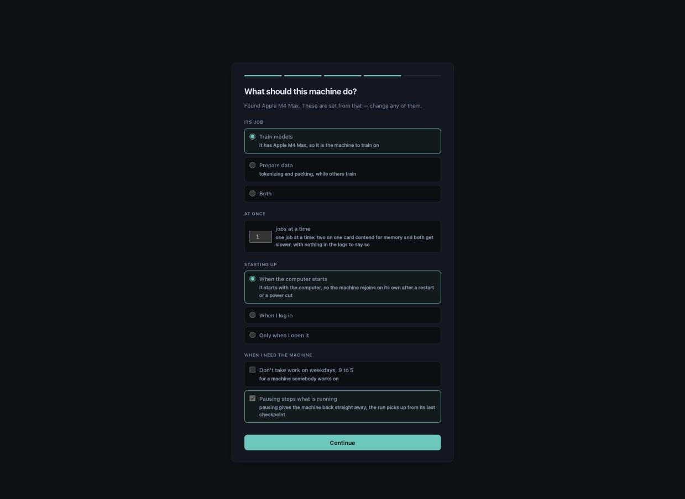
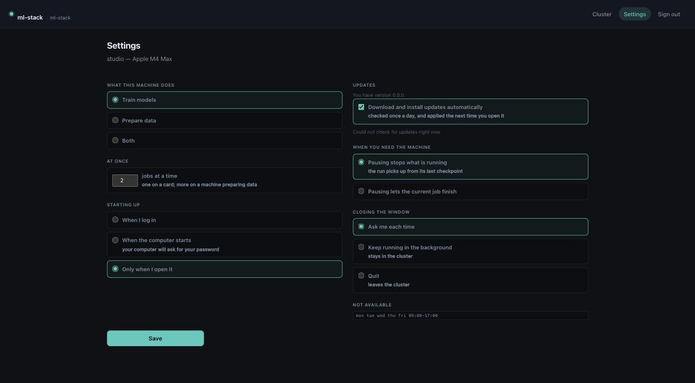

# Installing

One script per platform, four modes. Re-running any of them upgrades in place.

**macOS and Linux:**

```
curl -fsSL https://raw.githubusercontent.com/adammikulis/poolhouse/main/packaging/install.sh | sh
curl -fsSL https://raw.githubusercontent.com/adammikulis/poolhouse/main/packaging/install.sh | sh -s -- --headless
curl -fsSL https://raw.githubusercontent.com/adammikulis/poolhouse/main/packaging/install.sh | sh -s -- --dev
curl -fsSL https://raw.githubusercontent.com/adammikulis/poolhouse/main/packaging/install.sh | sudo sh -s -- --system
```

**Windows**, in PowerShell. `iex` runs a piped script with no arguments, so the mode is an
environment variable rather than a scriptblock incantation:

```
irm https://raw.githubusercontent.com/adammikulis/poolhouse/main/packaging/install.ps1 | iex
$env:POOLHOUSE_MODE="headless"; irm https://raw.githubusercontent.com/adammikulis/poolhouse/main/packaging/install.ps1 | iex
$env:POOLHOUSE_MODE="dev";      irm https://raw.githubusercontent.com/adammikulis/poolhouse/main/packaging/install.ps1 | iex
$env:POOLHOUSE_MODE="system";   irm https://raw.githubusercontent.com/adammikulis/poolhouse/main/packaging/install.ps1 | iex   # as administrator
```

| | what it installs | what it downloads | how it updates itself |
|---|---|---|---|
| **the app** (default) | the release zip for this machine, and a window | nothing, until you click: the first-run screen shows the models that fit, gemma-4-E2B suggested (2.6G, ~1.5s a question) beside E4B (4.4G, ~3s) and Flash-Next (104G, ~27s), the ones too big for the room greyed out | the newest published release, replacing the whole install — daemon, CLI and window — then restarting |
| `--headless` | a venv under `~/.poolhouse` (Windows: `%LOCALAPPDATA%\poolhouse`), console scripts on PATH, no window | `--models auto`: the best measured model this machine has room for, unless `POOLHOUSE_MODELS=none` | releases, the same way — or `main`, if you installed from `main` |
| `--dev` | a git checkout with `pip install -e .` | the same as headless | follows `main`: pulls, reinstalls if the packaging moved, restarts |
| `--system` | `--headless`, plus a service that starts at boot with nobody logged in. Needs `sudo` / an administrator | the same as headless | the same as headless |

**Per user or per machine.** The first three need no administrator and the daemon runs
while you are logged in; the fourth is per machine:

| | per user (app, headless, dev) | per machine (`--system`) |
|---|---|---|
| rights | none | `sudo`, or PowerShell as administrator |
| runs | while you are logged in | at boot, before anyone logs in |
| as | you | still you — see below |
| the Windows firewall | one approval prompt, once | the same, in the same step |
| the macOS wired limit | `sudo` once, offered by the app's first run and by `poolhouse-setup` | applied in the same step, since it already has the rights |
| the model cache | yours, `~/.cache/huggingface` | **the same one.** One cache per machine, shared, never duplicated |

That last row is why `--system` installs the service to run **as the account that ran it**
(a LaunchDaemon with `UserName`, a systemd unit with `User=`, a Scheduled Task with `/RU`)
rather than as root or SYSTEM. A service under another account would have its own empty
`~/.cache/huggingface` and download every model a second time; running as you, it opens the
one that is already there, in place, and nothing is copied, linked or fetched twice. If you
do point it at another account, the installer lists the models you have with their sizes and
says they would be downloaded again; `--adopt-cache` *moves* the cache to the shared path and
leaves a symlink behind, so your own tools keep working and every file still exists once.
Declining leaves your cache alone. It never copies.

That cache is also where Poolhouse puts what it downloads. `poolhouse-models pull`, `fetch`, `snapshot`
and serving an `hf:` reference write the layout `huggingface_hub` writes (`models--owner--repo/blobs`,
`snapshots/<commit>`, `refs`) into whichever folder `HF_HUB_CACHE`, `HF_HOME` or `XDG_CACHE_HOME` names,
so `hf`, transformers and Poolhouse share one copy. Earlier versions kept models in `~/.poolhouse/models`;
`poolhouse-models migrate plan` then `poolhouse-models migrate run` move them into the cache once
(docs/model-discovery.md, "Moving the old store").

Everything Poolhouse keeps for itself is under `~/.poolhouse`: the measured records, the runs
store, the llama.cpp builds it made, the record of which model servers are running, and how
much of this machine it may take. `POOLHOUSE_HOME` moves the lot somewhere else -- a second
disk, a shared volume -- and each of `POOLHOUSE_BENCH_HOME`, `POOLHOUSE_INGEST_HOME`,
`POOLHOUSE_JOBS_HOME`, `POOLHOUSE_TRAIN_HOME`, `POOLHOUSE_FIT_FILE`, `POOLHOUSE_PROFILES_FILE` and
`POOLHOUSE_LIMITS_FILE` moves one corner of it on its own. What can be fetched or rebuilt --
downloads, one directory per long command's logs -- lives under `~/.cache/poolhouse`, which
`POOLHOUSE_CACHE` moves and which is safe to delete.

Unattended, for a machine you are setting up from a script: `POOLHOUSE_NAME`,
`POOLHOUSE_PASSPHRASE`, `POOLHOUSE_CLUSTER`, `POOLHOUSE_MODE`, `POOLHOUSE_MODELS`,
`POOLHOUSE_ADOPT_CACHE`, `POOLHOUSE_REF` answer every prompt, and a machine with no terminal
is never prompted at all. `POOLHOUSE_OFFLINE_ZIP` and `POOLHOUSE_OFFLINE_MODELS` install from
local files and skip every network step; `POOLHOUSE_OFFLINE_WHEELS` names the directory the
extras are installed from -- `python packaging/build.py --wheelhouse` fills one, and a
`wheels` directory beside the zip is taken without being named. Without it the machine
gets Poolhouse and none of its extras, and the install says which parts those are. `--uninstall` takes it off and leaves the model
cache where it is.

For an owned local telemetry source checkout, build its wheel explicitly:

```sh
python packaging/build.py --metal-smi-source /path/to/metal-smi --wheelhouse
```

The builder snapshots the source into a temporary directory, builds without dependency
wheels, and validates that its metadata provides `metal-smi>=1.1.0`. The source checkout,
including uncommitted changes, stays untouched. The validated wheel lands beside the
Poolhouse wheel in `dist/` and is included in a standalone bundle. Dependency wheelhouse
resolution searches both `dist/` and `dist/wheels/`; rebuilding Poolhouse preserves owned
and dependency wheels. A source option is explicit, with no machine-specific path or
unpublished remote reference embedded in Poolhouse's dependency metadata.

Until `metal-smi>=1.1.0` is published on the public package index, a generic macOS
`pip install 'poolhouse[all]'` cannot resolve telemetry from that index alone. Use the
validated local wheel or a bundle containing it, for example
`python -m pip install --find-links dist '.[telemetry]'` from the source checkout. This
build option creates local install artifacts; it does not publish or commit either project.

Past the install, every step is a Poolhouse command rather than shell -- `poolhouse-setup`
(what this machine can do), `poolhouse-serve build` (llama.cpp), `poolhouse-models fetch`
(into the one cache, every download checked against its sha256), `poolhouse-cluster join
--persist`, and `poolhouse-doctor` at the end, whose lines it prints.

**Or download it yourself** from the [latest release](https://github.com/adammikulis/poolhouse/releases/latest):

| | |
|---|---|
| macOS | `poolhouse-macos-arm64-<version>.zip` — Apple silicon (M1 or later) |
| Windows | `poolhouse-windows-x86_64-<version>.zip` |
| Linux | `poolhouse-linux-x86_64-<version>.zip` |

Each download holds the app and `poolhouse-headless`, for a machine with no screen — the
same daemon, serving the interface to a browser on your network.

On macOS the graph store needs **macOS 15 or newer**: its engine publishes wheels from that
release on, so an older Mac has none to install and tries to compile it instead.
`python -m poolhouse.installed` names it, and so does the installer's own `what came with it`
step. Everything else runs on macOS 13 and 14.



Do the same on every machine you want to train with, typing the same passphrase. They
find each other on their own.

**On Windows** the same daemon runs, with the handful of things Windows does differently
decided in one place (`poolhouse/platform.py`): a job gets its own process group and is
stopped with a `CTRL_BREAK_EVENT` it can catch as `SIGBREAK`, the one-runner lock is
`msvcrt.locking` where POSIX has `flock`, the cluster key is made private with `icacls`
where `chmod 600` would only flip the read-only bit, and `poolhouse-traind --persist`
registers a Scheduled Task at logon (`com.poolhouse.traind.login`) the way `poolhouse-serve
build --persist` registers its weekly refresh. `--system` registers a second one
(`com.poolhouse.traind.system`) at `ONSTART` instead, so the machine is a peer before anyone
logs in -- with `/RU <you>` rather than `/RU SYSTEM`, because SYSTEM has its own profile and
would download every model again into an empty cache. It is a Scheduled Task rather than a
real service because a service needs a wrapper to hold a long-lived Python process, while a
startup task is one line and survives a reboot either way. Two things a Windows machine needs that the
others do not: llama.cpp comes from `poolhouse-serve build --from release` (a release zip,
since most Windows installs have no compiler), and **Windows Defender Firewall blocks the
daemon's TCP 8770 and its UDP 8771 beacons inbound by default**, so `poolhouse-peers ls` on
another machine sees nothing until, in a prompt opened as administrator:

```
netsh advfirewall firewall add rule name="poolhouse traind" dir=in action=allow protocol=TCP localport=8770 && netsh advfirewall firewall add rule name="poolhouse discovery" dir=in action=allow protocol=UDP localport=8771
```

`poolhouse-setup` prints that line as a finding until both rules exist. The first time on a
new Windows machine, in this order, each of which should say what follows it:
`pip install -e .` (an editable install, so `poolhouse-traind` is on PATH);
`poolhouse-setup` (the firewall finding, `!` until the rules are added, then `ok`);
`poolhouse-doctor` (the checkout and hooks);
`poolhouse-serve build --from release` ("current -> ...\builds\bNNNN" after "verifying");
`poolhouse-traind --persist` ("installed to start at login", then a `traind.log` under
`~\.poolhouse` that begins `poolhouse traind on http://0.0.0.0:8770`);
`poolhouse-peers ls` from another machine (the Windows box listed with its GPU). `ci.yml`'s
`windows` job runs `install.ps1 -Headless` end to end on a Windows runner -- a venv under a
scratch prefix, the console scripts on its own PATH, then `-Uninstall` taking the venv away
again -- against a wheel built in the same job, with no model and no network.

**If you write Python**, on 3.12 and later (developed and tested on 3.13):

```
pip install git+https://github.com/adammikulis/poolhouse
pip install "poolhouse[train] @ git+https://github.com/adammikulis/poolhouse"
pip install "poolhouse[all] @ git+https://github.com/adammikulis/poolhouse"
```

The first is all of it and nothing else -- pure Python, over `packaging` and the standard
library. `[train]` adds numpy and safetensors; `[all]` adds everything the rest of it can
use. Every
[release](https://github.com/adammikulis/poolhouse/releases/latest) carries the same wheel,
for a machine with no git: `pip install ./poolhouse-<version>-py3-none-any.whl`.

Building from source needs `pip install build`, then:

```
python packaging/build.py            # wheels into dist/
python packaging/build.py --bundle   # and the app for this platform (needs Rust, node)
```

## Starting at login and keeping the runtime current

Units that start Poolhouse for you are prepared by a command anyone (or any agent) can run and
installed by you, at your own terminal, with one command it prints. Nothing writes to
`~/Library/LaunchAgents`, `~/.config/systemd/user` or a system directory until you run that
command.

```
python -m poolhouse.fleet.autostart prepare --launchers <launcher directory> --role pool-daemon --role runtime-ensure
python -m poolhouse.fleet.autostart install --manifest <the path prepare printed>
```

`prepare` takes `--launchers DIR`, the directory `poolhouse runtime ensure --launchers` keeps
its stable launchers in, and `--system` to stage the system-wide location instead of your own. It writes the unit files and a
`manifest.json` under `~/.poolhouse/autostart/staging/`. The manifest holds the role, platform, destination path, the
sha256 of each unit, the exec argv (the launcher's absolute path and its options, never a shell
string), a path-only environment, the working directory, the restart policy, the log paths, who
prepared it, the device it is for and a 24-hour expiry.

`install` shows what it will do, asks you to type the manifest id, then refuses unless the
manifest has not expired, was prepared for this device, names a launcher the runtime tooling
wrote (not a checkout, not an editable install), and every staged unit still has the recorded
hash and is what `prepare` would write today. It backs up each file it replaces, writes the unit,
loads it, checks that it is loaded and that the daemon answers its health probe, records the
install in the authority audit log, and prints the command that undoes it:

```
python -m poolhouse.fleet.autostart rollback
```

`--system` installs to `/Library/LaunchDaemons` or `/etc/systemd/system` through the operating
system's own administrator prompt. Poolhouse never sees the password and never writes a `sudoers`
rule. The unit still runs as you.

`python -m poolhouse.fleet.autostart status` (also `verify`, which exits 1 unless current) prints
`autostart: current | stale | missing | drifted | not-prepared`. `poolhouse-workspace status` and
the device report carry the same word. *stale* means a newer preparation differs from what is
installed; *drifted* means a unit was edited or removed, the launcher is missing or no longer
a runtime launcher, or the service manager does not hold the unit.

| Role | Runs | Restart |
|---|---|---|
| `pool-daemon` | the daemon, at login | restart on failure, 30 s apart, at most five starts in five minutes (systemd), a throttle interval (launchd), a retry count (Windows) |
| `runtime-ensure` | `poolhouse runtime ensure` at load and hourly, with no agent identity in its environment | a schedule, not a resident process |

The daemon holds a per-root lock, so a second start exits instead of competing, and rotates the
log files under `~/.poolhouse/autostart/logs` when one passes 5 MiB (three copies kept; systemd
units log to the journal instead). A unit points at the launcher path, whose contents `ensure`
switches atomically when it selects a new runtime, so a runtime upgrade needs no reinstall.
The units carry no tokens and no secrets, and there is no unit for landing work: landing needs
an agent identity (claims, board posts, push rules), so it stays in an agent session.

`runtime-ensure` runs `poolhouse runtime ensure` as no agent: it takes the build lock only,
claims nothing and posts nothing to the board (see *Following the source checkout*). It needs
the checkout a first `ensure` recorded, and `prepare` refuses a role whose
`poolhouse` launcher is not there.

Checking a reboot is manual, because a test cannot reboot a machine:

1. `prepare`, `install`, then `status` prints `autostart: current`.
2. Reboot, log in, wait a minute. `status` prints `autostart: current` and
   `poolhouse-peers ls` from another machine lists this one.
3. Kill the daemon process: it returns within the restart interval; kill it six times in
   five minutes and the manager stops restarting it (systemd), which `status` shows as drifted.
4. Edit the unit file: `status` prints `drifted`. `rollback` restores the file it replaced.
5. Linux only: with the user unit installed, `loginctl show-user $USER -p Linger` says
   `Linger=yes`, so the unit starts at boot before you log in.
6. macOS and Windows: let a log pass 5 MiB and confirm it is copied aside and emptied.

Everything is adjustable later:




## Following the source checkout

`poolhouse runtime` keeps the installed runtime on the commit a source checkout's development branch is on. Each runtime is its own tree, `~/.poolhouse/runtimes/<platform>/<commit>/<id>`, built from `git archive <commit>` with the extras a full install asks for and never changed afterwards. Console launchers (`poolhouse-workspace` and the rest) are small files that exec the selected tree's interpreter with `-I`.

```
poolhouse runtime ensure [--checkout PATH] [--launchers DIR] [--ref REF] [--force] [--force-build] [--allow-unmerged] [--background] [--agent NAME]
poolhouse runtime status [--json]
poolhouse runtime rollback [--to COMMIT]
```

The first `ensure` names `--checkout` and, to have launchers rewritten, `--launchers DIR` (an absolute directory holding the console launchers); both are recorded for later runs. Without a launcher directory the selection changes and launchers are left alone. When an authenticated workspace agent is known (`--agent`, `POOLHOUSE_WORKSPACE_AGENT`, or the session's agent passed by the hooks), `ensure` takes its install claims and posts to the board as that agent. With none (launcher recovery, a hook outside an agent session) it takes no claim and posts nothing, relying on the build lock and writing `ensure.log`. `rollback` and `ensure --force-build` need an agent. `status` needs none and writes nothing. `ensure` does nothing when the selection already names the commit. Otherwise it takes the build lock, then `claim install` on the new tree, the launcher directory and the selection file, and:

1. builds the commit into a new tree beside the old ones;
2. smokes it: the package imports under `-I`, its stamped commit equals the commit, `poolhouse-workspace --help` runs through freshly written launchers, and `claude-session-start`, `claude-subagent-start` and `claude-subagent-stop` from that commit run against a temporary home and state root;
3. rewrites every launcher with a temporary file and a rename, then publishes `selected.json`.

A failed build or smoke removes the new tree, records the failure and leaves the previous runtime selected. Nothing waits for agents, jobs or models: running processes keep executing the tree they started from, and only new invocations see the new one. The daemon restarts onto the selected runtime at its own idle boundary (no job, no measurement, no loaded model).

**Recovery.** A launcher whose tree is missing, has no importable `poolhouse`, or is marked `rejected` runs the newest verified runtime instead; with none left it starts `ensure` from the recorded source checkout (a valid checkout only, at most once a minute, output in `ensure.log`). The launcher prefers the tree `selected.json` names and skips the commit a rollback holds. `ensure` replaces a selection that does not verify with the newest verified fallback, then builds the commit. `packaging/runtime-floor` holds one integer; a runtime records the integer its own source held, and a runtime below the checkout's integer is replaced and marked `rejected`. Raising the integer is how a change retires older runtimes. A rollback hold never blocks recovery of a broken selection. Only trees this command created (a `created.json` naming `poolhouse-runtime`) are ever selected as a fallback, rejected or deleted; trees another tool made in the same directory are left alone and `status` lists them with their size and whether a process is inside. A selection that points at such a tree has epoch 0, so the first `ensure` replaces it. A commit whose build failed is not built again automatically for ten minutes; `ensure --force-build` builds it at once. The newest three of its verified trees besides the selected one are kept; the rest are deleted unless a live process runs from or has its working directory in them.

**Triggers.** The Claude `SessionStart` hook, the `post-merge` git hook and the pre-push check run `ensure --background`, which returns within six seconds and builds in a detached process; one build runs at a time. `POOLHOUSE_RUNTIME_ENSURE=off` disables the triggers.

**Which commits.** A deploy builds only the tip of the development branch in the recorded primary checkout, or a commit that is an ancestor of it. The primary checkout is the main worktree of the repository the first `ensure` recorded; `--checkout` naming a worktree of that repository is a source of objects and nothing more, and naming another repository is refused unless a person runs it at a terminal. The epoch floor is read at the development branch tip, never at the commit being built. `--allow-unmerged` deploys any other commit and needs a person at a terminal who types the ref back; an agent-started process is refused. A fresh machine has no recorded repository, so the first `ensure` is a person's. A process started by an agent ignores `POOLHOUSE_HOME`, `POOLHOUSE_CACHE` and the per-name state variables, and says so. Every `ensure` and `rollback`, including a refused one, appends a `runtime.deploy` record to the activity log with the commit, the command, the agent and whether a person ran it.

**Rollback.** `rollback` selects the newest earlier verified runtime (or `--to`), rewrites the launchers and holds the commit it left; `ensure` skips a held commit until the branch moves, or with `--force`.

**Board.** A switch posts a `milestone` to `#announcements` and a failed build or recovery posts `blocked` with the `poolhouse-doctor hooks` diagnostic id, as the agent in `POOLHOUSE_WORKSPACE_AGENT` (or `--agent`); the install claims are held by that agent and appear in `poolhouse-workspace claims`; each agent's device profile carries the commit of the runtime it runs.

**Who may deploy.** A person, a launcher and a login unit run `ensure`, `rollback` and `restart-host` as before. An agent process (one the harness marked with `CLAUDECODE`, `POOLHOUSE_AGENT` or `POOLHOUSE_NONINTERACTIVE`) must pass the `runtime.deploy` authority gate: a lead agent passes while the owner has it delegated, which the Dev preset does and `poolhouse-workspace authority preset prod` takes back (`authority set person runtime.deploy` revokes it alone, `authority set delegated runtime.deploy` grants it again, `authority show` says which). A helper agent, and any agent while the gate is the person's, is refused with the reason and the refusal is recorded. Each pass writes an `authority.use` row naming the agent and each command, passed or refused, a `runtime.deploy` activity record with the agent and `delegated`. A delegated agent deploys exactly what a person could without a terminal: the tip of the development branch or one of its ancestors in the recorded repository. `--allow-unmerged` and another repository stay a person's, a failed smoke still leaves the selection alone and `rollback` still holds the commit it left. `ensure --background`, which the session hook and the post-merge hook run for the merged tip, is not gated; `POOLHOUSE_RUNTIME_ENSURE=off` switches those triggers off.

**The app's host.** The daemon Poolhouse starts is the bundled `poolhouse-headless`, a frozen binary whose code is whatever was built into the app. It does not stay there: at start it checks the runtime `ensure` selected, verifies it, and replaces itself (`execve`, so the app keeps the same process id and its quit path still stops it) with that runtime's interpreter running the same launcher, with the same `--port` and `--root`. With no verified selected runtime it carries on as the bundle. The seam is the sidecar and not the Rust launcher so that the selection is verified by one implementation (`poolhouse.runtime.verify`: isolated import, stamped commit, platform) and an older app that has the seam follows without being rebuilt. A host that is already running only picks up a new selection when it restarts, and `poolhouse runtime restart-host [--port 8770] [--root DIR] [--within SECONDS] [--force]` does that: it finds the host on the port, does nothing if it already reports the selected commit, and otherwise runs `poolhouse --restart` from the selected runtime, which asks the old host through its launcher control to stop at the job-preserving boundary (requests drained, jobs checkpointed, stores closed) and starts the new one on the same port and root. It waits until the host reports the selected commit. It never signals a process, so a store writer is never killed; a host that predates the launcher control is refused with the reason and left running (quit and reopen Poolhouse once, after which every deploy restarts it by itself). The window keeps its address; the replacement is started outside the app, so quitting Poolhouse leaves it running and the next launch finds it healthy. When the app does stop a daemon it started, it sends SIGTERM and waits up to 30 seconds for it to close its stores before anything stronger.

The commands a lead runs to deploy and restart after a landing: `poolhouse runtime ensure --agent NAME`, then `poolhouse runtime restart-host --agent NAME`.

`status` prints:

```
runtimes     <state>/runtimes/<platform>
source       <checkout> at <commit> (floor <commit>)
selected     <commit> healthy  <tree>
current      yes
launchers    <directory>
  * <commit>  verified <time>  <tree>
```

with `held`, `last failure` and `building` lines when they apply.
